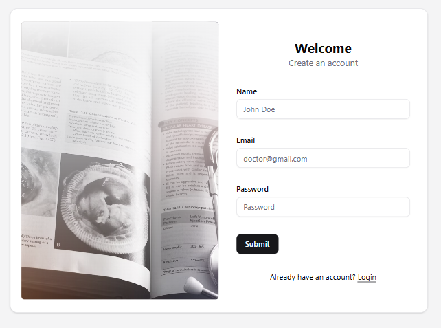
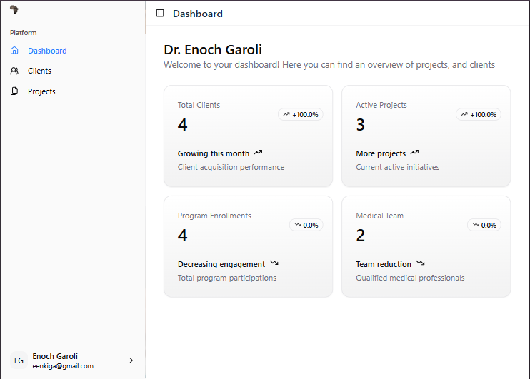
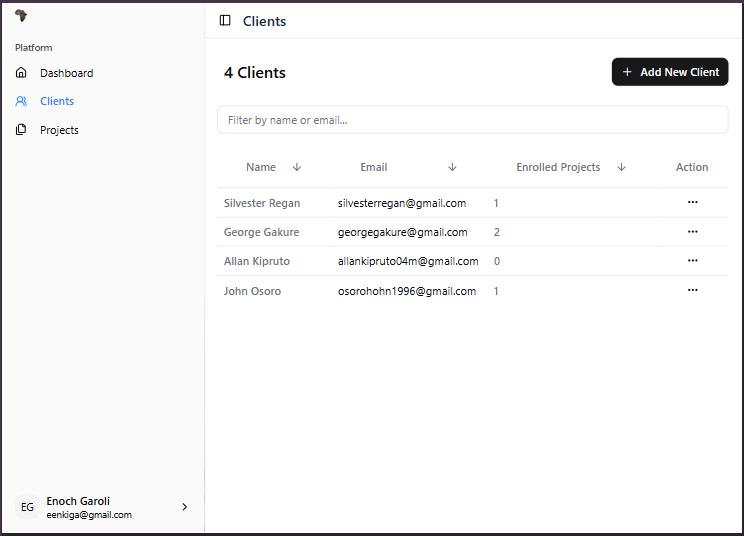
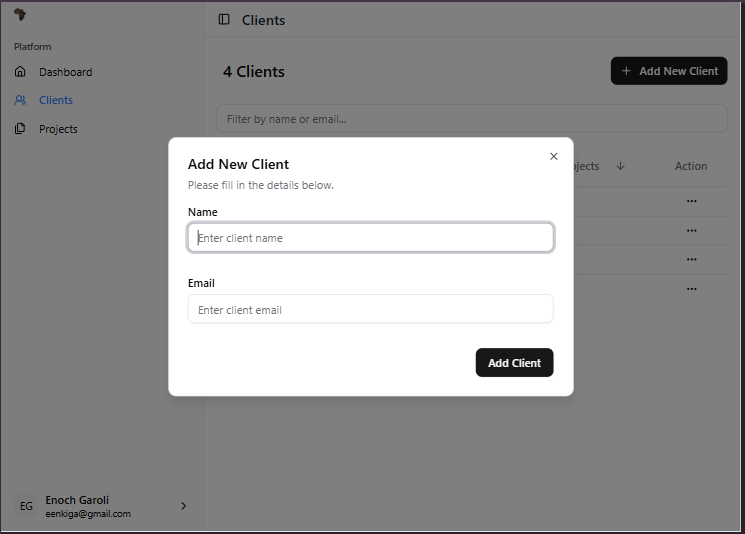
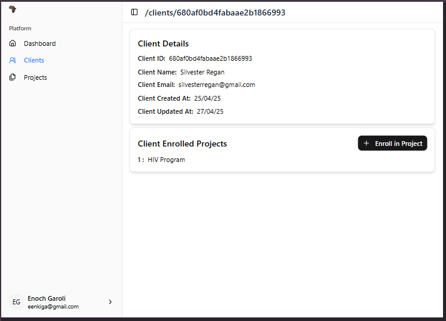
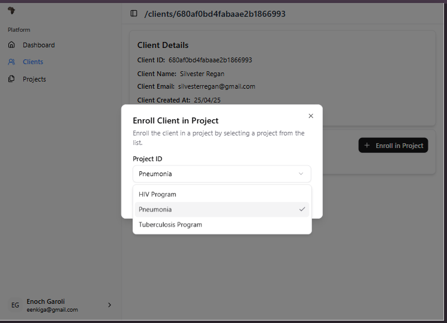
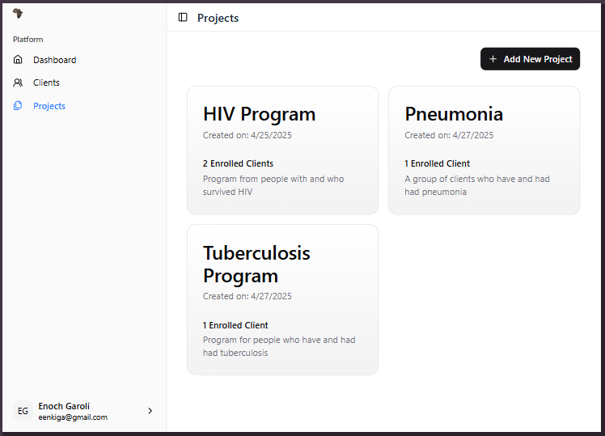
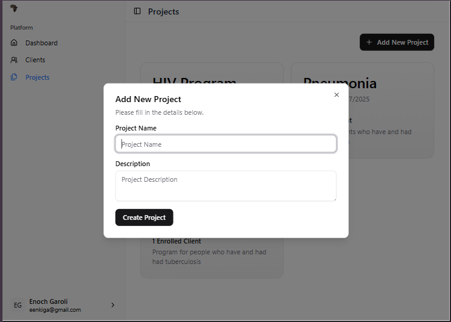

# CEMA HIS Frontend

## Description
CEMA HIS Frontend is a web-based application designed for managing hospital information systems. It provides a user-friendly interface for healthcare professionals to access and manage patient data, appointments, and other hospital-related information.

## Features

- User authentication and authorization
- Client management
- Project management
- Reporting and analytics
- Responsive design for mobile and desktop devices
- Integration with backend APIs

## Screenshots

**Auth Page**:

**Dashboard**:

**Client Management**:

**Project Management**:

